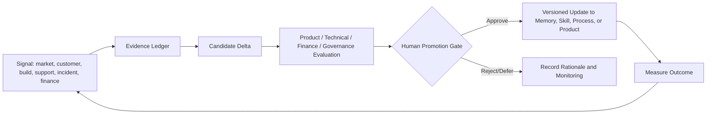

# Human Blockchain One-Prompt Blueprint

## Executive Position

**Yes: a detailed Human Blockchain operating-system library can become the launchpad for a single-prompt, project-based venture system.** The most powerful form is not an all-knowing prompt that tries to do everything at once. It is a **Mission Compiler**: one approved instruction turns a constitutional knowledge library into a bounded work graph, retrieves only relevant evidence, delegates defined specialist roles, produces standard decision artifacts, and stops where a human decision is required.

This is the strongest modern interpretation of MetaGPT’s original thesis. MetaGPT showed that role specialization, standardized operating procedures, and structured intermediate artifacts can reduce the inconsistency created by naive agent chaining.[1] The Human Blockchain system can extend that pattern from a software assembly line into an enduring operating system for venture creation, product development, governance, commercial operations, and institutional learning.

> **The Rosetta Stone supplies identity and purpose. The General’s Library supplies evidence. The Mission Compiler supplies execution discipline. The founder supplies authority.**

## The Most Important Ideas

| Idea | Why it matters | Practical effect |
|---|---|---|
| **Replace the giant prompt with a context assembly system.** | A comprehensive library is valuable only if the system can retrieve the relevant pieces, preserve source links, and label uncertainty. | Each mission receives a small, cited context pack instead of an uncontrolled dump of the entire archive. |
| **Make the primary product of agents a decision packet, not prose.** | Reports are easy to generate; decisions require evidence, options, trade-offs, authority, and a next action. | Every major stage ends with an approval-ready packet for the named human owner. |
| **Turn every venture into a work graph.** | Needs analysis, market research, business planning, MVP selection, PRD, SRS, build, sales, and support are dependencies—not disconnected documents. | The system knows what must be complete before the next stage is authorized. |
| **Use agents as an organization chart with artifact contracts.** | “Agent teams” fail when roles overlap, context leaks, or agents invent authority. | Each role gets a bounded task, permitted inputs/tools, output file, evidence standard, timebox, and escalation rule. |
| **Define self-improvement as controlled promotion.** | An agent that silently rewrites its prompt, memory, or processes is difficult to trust. | Signals create versioned change proposals; evidence, evaluation, human approval, and monitoring determine promotion. |
| **Make sales and support first-class research functions.** | The most valuable market evidence arrives after launch, through customer language, objections, adoption, support, and retention. | Commercial signals flow back into the evidence ledger, opportunity map, PRD, business model, and training materials. |
| **Separate narrative truth from operating truth.** | The Human Blockchain’s narrative world is a major strategic asset, but it must not be mistaken for externally verified business, financial, technical, or legal fact. | The system can use narrative for brand, training, community, and world-building while keeping evidence-led claims separately governed. |

## What One Setup and Prompt Can Accomplish

Once the knowledge, authority, templates, and agent roles are pre-provisioned, one approved mission prompt can complete the following **without needing to rediscover the operating model each time**:

| Workstream | Single-prompt initialization outcome | Human approval still required for |
|---|---|---|
| Needs analysis | Stakeholder brief, job/problem hypotheses, research plan, evidence/assumption ledger. | Selecting the market problem to own. |
| Market research | Competitor/complement map, source-linked evidence, differentiated opportunity map. | Material market claims, customer interviews, or non-public research. |
| Business modeling | Value creation logic, channels, cost/revenue assumptions, milestones, risk map. | Economic commitments and external business claims. |
| Business planning | A business-plan draft linked to evidence, model assumptions, operating plan, and open decisions. | Approved strategy, budget, or partner commitments. |
| Funding and valuation strategy | Milestone-to-capital map, scenario model structure, use-of-funds logic, diligence checklist, investor narrative draft. | Fundraising, valuations asserted externally, securities, financing terms, or transactions. |
| MVP determination | Riskiest-assumption ranking, MVP charter, experiment design, measurable learning threshold. | Committing implementation resources. |
| PRD and SRS | Linked PRD, SRS, acceptance criteria, roles, data model, threat model, architecture options, and ADR proposals. | Product scope, architecture, security, privacy, and build authorization. |
| Technical delivery | Repository plan, tickets, implementation sequence, test plan, deployment and rollback plan. | Production deployment, access changes, infrastructure spend. |
| Agent teams | Selects only the necessary roles, prepares delegation packets, aggregates outputs, and creates review/evaluation traces. | New agent authority, tool access, sensitive-data access, or high-impact automation. |
| Automation | Designs deterministic workflows, schedules, monitoring criteria, retries, stop conditions, and ownership. | Enabling external side effects, persistent services, or automated communications. |
| Living documentation | Creates mission folders, canonical templates, ADRs, delta specs, evidence ledgers, and master handoffs. | Changing constitution, authority rules, or approved baselines. |
| Version control | Creates branch/checkpoint plans, review requirements, change lineage, release packet, and rollback criteria. | Merge/release approval for protected or production assets. |
| Business development, sales, and support | Creates ICPs, account maps, messaging, demo narrative, discovery scripts, support taxonomy, and feedback loops. | Contacting prospects, publishing claims, pricing, contracts, refunds, or service commitments. |

## The Operating Model

The full model has six layers. The first three make the system knowledgeable; the next three make it useful without becoming uncontrolled.

| Layer | Function | Human Blockchain asset or pattern |
|---|---|---|
| **Constitution** | Mission, non-negotiables, authority, defined terms, prohibited actions. | Rosetta Stone, founder directives, entity rules, stakeholder taxonomy. |
| **Evidence library** | Append-only source material with provenance and access restrictions. | General’s Library, source manifests, research, operational records. |
| **Declarative memory** | Curated stable facts, relationships, decisions, and instructions. | `MEMORY.md`, glossary, entity/relationship maps, five-category extraction. |
| **Mission compiler** | Converts one approved mission into a context pack, work graph, agents, artifacts, and gates. | Kimosabe Core / Chief-of-Staff function. |
| **Execution lanes** | Runs discovery, product, finance, engineering, commercial, and support work. | Specialized agent roles with artifact contracts. |
| **Governance and learning** | Evaluates results, records decisions, promotes controlled changes, and monitors outcomes. | ADRs, delta specs, risk register, scorecards, master handoff. |

A source-grounded, modular knowledge design is preferable to a monolithic prompt. GraphRAG’s architecture illustrates the value of a structured knowledge model, indexing pipeline, configurable storage/providers, and cached repeated inputs; these are useful patterns for a corpus that must be queried, refreshed, and audited over time.[2]

## The Decision Gates That Preserve Founder Control

The “single prompt” should always build toward a human gate. It should not jump directly from a narrative vision to capital spending, public messaging, or deployment.

| Gate | Question | Required decision artifact |
|---|---|---|
| G0 — Mission admission | Is this work aligned, scoped, owned, and authorized? | Mission brief and work graph. |
| G1 — Thesis | Is the target stakeholder/problem/opportunity worth testing? | Evidence-led opportunity map and assumption register. |
| G2 — MVP | What is the smallest experiment that can resolve the most important uncertainty? | MVP charter with success/failure threshold. |
| G3 — Capital posture | What milestone needs capital, what evidence supports the case, and what terms/control are acceptable? | Scenario model and financing decision packet. |
| G4 — Build | Are PRD, SRS, ADRs, data/security constraints, cost, and acceptance criteria sufficient? | Build authorization packet. |
| G5 — Release | Has the intended risk been tested, is support ready, and is rollback possible? | Release packet and risk acceptance. |
| G6 — External commitment | Is the message, price, proposal, contract, or partnership authorized? | External-action packet. |
| G7 — Promotion | Should a new learning change memory, policy, skill, automation, or baseline plan? | Evidence-linked delta specification and evaluation record. |

This organization emphasizes governance, monitoring, accountability, and human review—the core orientation of NIST’s AI Risk Management Framework—without claiming compliance merely because the framework is referenced.[3]

## Agent Team: Start Small, Then Earn Complexity

A common failure is launching too many “agents” before the knowledge, artifact contracts, and decision rights are stable. Begin with five roles and grow only after the system demonstrates repeatable evidence quality.

| Stage | Roles | Demonstrated capability required to advance |
|---|---|---|
| **Stage 1 — Mission Pilot** | Core, Librarian, Discovery Analyst, Product/Technical Lead, Documentation/Risk Reviewer. | Complete one mission from evidence to MVP decision with traceable artifacts and a useful founder decision. |
| **Stage 2 — Build and Learn** | Add Experience Lead, Engineering/QA Lead, Finance/Strategy Analyst. | Deliver one MVP with test evidence, release packet, and post-launch learning loop. |
| **Stage 3 — Commercial Loop** | Add Growth/BD/Sales and Customer Success/Support roles. | Tie qualified conversations, adoption, support, and retention signals back to product and business deltas. |
| **Stage 4 — Portfolio and Automation** | Add portfolio planner, automation steward, narrative/community roles, and domain-specific stakeholder agents. | Show measured operational benefit, reliable audit trails, bounded side effects, and human-review capacity. |

The exact number of agents does not matter. **Role boundaries, artifact contracts, and escalation rules do.** This is the part of MetaGPT’s SOP-based collaboration model worth preserving.[1]

## Funding and Valuation as a Governance System

> **Finance note:** I am an AI, not a licensed financial advisor. This is operating-model analysis, not guaranteed advice. Any funding, valuation, securities, or transaction decision should be reviewed with qualified financial and legal professionals.

The funding lane should continually answer three questions: **what is the next risk-reduction milestone; what evidence proves it; and what capital or partnership structure best fits it?** The system should produce scenario ranges and assumptions, not a single unsupported valuation number.

| Component | What it establishes | Evidence needed |
|---|---|---|
| Operating economics | Whether the venture’s pricing, cost, capacity, channel, and retention logic can work. | Customer pricing signals, cost assumptions, conversion/retention evidence. |
| Value-creation milestones | Which proof points reduce risk or increase strategic value. | Product proof, customer proof, distribution proof, IP/process maturity, data assets. |
| Financing fit | Whether the next milestone needs bootstrapping, revenue, strategic partnership, grant, debt, equity, or another structure. | Use-of-funds, timing, control preferences, downside/risk analysis, counterpart fit. |
| Decision-ready valuation | A range based on scenario assumptions and clearly dated/defined comparables or cash flows where applicable. | Traceable financial inputs, source dates, sensitivity analysis, missing-data disclosure. |

For any actual valuation model, investor material, or capital-raising effort, keep the finance lane under its source hierarchy, fiscal-period discipline, input traceability, and owner review.

## The Self-Improvement Mechanism

A self-improving operating system should **not** allow free-form self-modification. It should use this managed loop:

An accepted change must name its evidence, owner, test/evaluation result, compatibility impact, rollback path, successor link, and monitoring metric. Architecture Decision Records provide a useful pattern: capture context, alternatives, rationale, and the link to any decision that supersedes the prior one.[4]

## First 90 Days: A Practical Adoption Path

| Period | Primary objective | Concrete deliverables | Success test |
|---|---|---|---|
| **Days 1–15: Establish the control plane** | Convert the knowledge library into a governed foundation. | `SOUL.md`, `AUTHORITY.md`, source manifest, curated `MEMORY.md`, glossary, mission index, evidence ledger, ADR/delta/risk/handoff templates. | A new session can explain the current mission, terms, authority, source basis, and next decision without loading the entire archive. |
| **Days 16–30: Run one beachhead mission** | Prove the workflow from need analysis through MVP decision. | Mission context pack, market/needs research, opportunity map, assumption register, MVP charter, decision packet. | Founder can make a specific G1/G2 decision using evidence rather than intuition alone. |
| **Days 31–60: Build and instrument one MVP** | Prove the PRD-to-SRS-to-release loop. | PRD, SRS, ADRs, test plan, release packet, support taxonomy, monitoring metrics. | The MVP has explicit acceptance criteria, rollback plan, owner, and post-launch learning mechanism. |
| **Days 61–90: Close the commercial and learning loop** | Make the system improve from real market contact. | ICP, sales narrative, discovery script, account map, support feedback ledger, first delta review, monthly portfolio review. | One customer/commercial/support signal results in a controlled, approved product/process/knowledge change. |

## Immediate Recommendation

Do **not** begin by trying to operationalize the entire 1-17-3350 universe. Begin with the **smallest defensible beachhead mission**—likely a single high-value user problem in the Insurance Restoration Market or another approved stakeholder segment—and build the reusable control plane around it. A successful first mission creates the templates, evidence habits, authority boundaries, and commercial feedback loop that every later domain can inherit.

The three supporting artifacts attached with this blueprint provide the detailed operating architecture, the reusable launch prompt, and the documentation/version-control contracts. The next practical step is to choose the first mission and populate its YAML mission input block.

## References

[1]: https://arxiv.org/abs/2308.00352 "MetaGPT: Meta Programming for A Multi-Agent Collaborative Framework"
[2]: https://microsoft.github.io/graphrag/index/architecture/ "Microsoft GraphRAG Architecture"
[3]: https://www.nist.gov/itl/ai-risk-management-framework "NIST AI Risk Management Framework"
[4]: https://aws.amazon.com/blogs/architecture/master-architecture-decision-records-adrs-best-practices-for-effective-decision-making/ "AWS: Architecture Decision Records"
