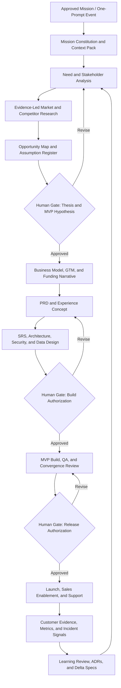

# Human Blockchain Integrated Venture Operating System

**Design status:** Draft architecture for review  
**Purpose:** Turn the Human Blockchain operating-system library into a governed, source-grounded system that can launch and coordinate multiple venture workstreams from a single instruction while preserving founder authority, evidence quality, and human decision rights.

## 1. Core Thesis

The system should not be designed as a single giant prompt or an autonomous corporation. It should be designed as a **constitutional control plane** that converts one approved mission instruction into a bounded work graph: retrieve the right evidence, create standardized artifacts, delegate contained roles, measure progress, and pause at defined human decision gates.

This preserves the durable insight in MetaGPT: encode established operating procedures, specialize roles, and use intermediate artifacts to prevent cascading inconsistency.[1] It also aligns with source-grounded, modular knowledge architectures rather than attempting to reason over an entire unprocessed library in every session.[2]

> **One prompt is the ignition key, not the constitution, database, board, or bank account.**

## 2. Architectural Layers

| Layer | Purpose | Human Blockchain implementation direction | Primary outputs |
|---|---|---|---|
| 0. Constitutional layer | Defines identity, mission, immutable rules, authority, and prohibitions. | Rosetta Stone, founder directives, entity rules, GL rules, stakeholder taxonomy, permitted-worldview boundaries. | `SOUL.md`, policy registry, authority matrix. |
| 1. Evidence library | Preserves raw source material and its provenance. | General’s Library, chat/archive corpus, source documents, market research, customer evidence, operating records. | Immutable source archive, source manifest, evidence ledger. |
| 2. Declarative memory | Distills stable facts, decisions, vocabulary, relationships, and instructions. | Five-category memory extraction mapped into Human Blockchain taxonomies. | `MEMORY.md`, glossary, entity graph, relationship graph. |
| 3. Work graph and registry | Translates an approved objective into owned, sequenced work. | A mission registry containing workstreams, artifacts, dependencies, status, and approvals. | Mission brief, work graph, backlog, delivery plan. |
| 4. Agent and human operating layer | Assigns bounded tasks to specialist roles and reserves decisions for humans. | Kimosabe Core as orchestrator; specialist lanes as delegated roles; Founder/authorized owners as approvers. | Delegation packets, review packets, evaluation traces. |
| 5. Product and commercial execution | Discovers needs, validates demand, builds an MVP, sells, supports, and learns. | Beachhead-first ventures that can later connect to the 1-17-3350 model. | Discovery record, PRD, SRS, MVP plan, sales playbook, support insights. |
| 6. Governance and learning | Promotes only evaluated changes into durable memory, skills, processes, or product plans. | ADRs, evidence-linked delta specs, evaluation records, human acceptance, versioned release notes. | ADRs, delta specs, scorecards, promoted knowledge packs. |

## 3. The Required Distinction: Library, Memory, and Mission Context

The General’s Library should remain the **evidence-preserving store**, while the Rosetta Stone and derived files become the **declarative memory**. A mission context is then a task-specific, temporary package assembled from those two layers. This avoids the primary failure mode of a “one prompt” strategy: an oversized context that is expensive, stale, ambiguous, and impossible to audit.

| Asset | Mutability | Who changes it | Change standard |
|---|---|---|---|
| Raw evidence archive | Append-only | Authorized ingest process | Preserve source, date, rights, and checksum/identifier. |
| Declarative memory | Controlled revision | Memory steward with founder approval for constitutional facts | Source-linked proposal and review. |
| Constitution and authority matrix | Highly controlled | Founder / designated governance owner | Explicit ADR and versioned approval. |
| Mission context pack | Ephemeral | Orchestrator | Retrieved from approved sources for one mission only. |
| Working artifacts | Iterative | Assigned role owner | Version-controlled updates with review status. |
| Product, business, and process baselines | Controlled revision | Named decision owner | Delta spec, decision record, acceptance evidence. |

## 4. Venture Work Graph: From Need to Durable Operations

A single mission should produce a traceable chain of decisions rather than a loose collection of reports. The work graph below is the reusable operating sequence for a new stakeholder group, platform clone/evolution opportunity, or beachhead product.



## 5. Operating Lanes and Required Artifacts

| Lane | Core question | Required artifact | Primary evidence | Human decision gate |
|---|---|---|---|---|
| Needs analysis | Whose problem is consequential enough to solve? | Stakeholder/job brief | Interviews, observed workflow, support/sales signals, approved hypotheses | Target user and problem selection |
| Market research | What alternatives and constraints exist? | Evidence ledger and market map | Primary sources, public product evidence, customer evidence, cited research | Differentiation thesis |
| Business modeling | How does the venture create, deliver, and capture value? | Business model canvas and unit-economics assumptions | Pricing evidence, costs, channel hypotheses | Economic model selection |
| Business plan | Why this venture, now, and how will it progress? | Decision-ready business plan | Linked discovery, market, financial, and operating assumptions | Funding/partner narrative approval |
| Funding and valuation | What capital is needed, what milestone unlocks it, and how is value evidenced? | Financing strategy, model, scenario/valuation memo | Traced assumptions, traction, comparables, fiscal-period-aligned data | Capital strategy and external positioning |
| MVP determination | What is the smallest test that can validate the riskiest assumption? | MVP charter and experiment plan | Importance/evidence scoring, customer outcome, feasibility constraints | Build/no-build and learning threshold |
| Product definition | What must the experience accomplish? | PRD | Jobs, outcomes, user stories, constraints, metrics | Product scope approval |
| System definition | How will the product operate reliably and safely? | SRS, data model, integration contract, NFR checklist | PRD, ADRs, risk model, architecture decisions | Build readiness |
| Technical delivery | What is the smallest appropriate architecture and release plan? | Technical plan, repository plan, test plan | SRS, stack trade-offs, security/privacy requirements | Technology and release approval |
| Quality and risk | Can the system be trusted at its intended level of risk? | Test evidence, threat model, accessibility review, adversarial review | DFDs, acceptance criteria, test results, incidents | Release authorization |
| Business development | Which relationships or channels can validate and distribute the offer? | Account map, partner hypothesis, outreach sequence | Market map, ICP, relationship history, permissioned contact data | External outreach / partnership approval |
| Sales | Can a target buyer understand, evaluate, and buy the offer? | Sales narrative, demo, proposal, pipeline record | Customer language, value proof, approved pricing | Pricing, contract, and non-standard commitment approval |
| Support and success | Are users achieving the promised outcome? | Onboarding, support taxonomy, success plan, feedback ledger | Tickets, conversations, adoption/retention signals | Policy or material service change approval |
| Institutional learning | What should change because of the evidence? | ADR, delta spec, evaluation record | Metrics, feedback, incidents, review findings | Promote/reject/defer change |

## 6. Agent Team Design

Use a **central orchestration / bounded delegation** model. The Core agent controls mission state, context selection, artifact contracts, and escalation. Specialist agents never receive unlimited authority; each receives a defined input packet, output contract, allowable tools/data, deadline, and escalation rule.

| Role | Primary responsibility | May autonomously produce | Must escalate before |
|---|---|---|---|
| Kimosabe Core / Chief of Staff | Routes missions, assembles context, assigns work, monitors progress, compiles a decision packet. | Work graph, status report, context pack, delegation packets. | Changing constitutional memory, committing resources, publishing externally, or resolving a material dispute. |
| Librarian / Evidence Steward | Ingests, classifies, retrieves, and cites approved knowledge. | Source manifests, evidence ledgers, retrieval packs, gap lists. | Treating an inference as a fact, changing source provenance, or promoting a source to constitutional truth. |
| Discovery and Market Analyst | Researches needs, markets, competitors, and alternatives. | Research memo, customer/problem map, assumption register. | External interviews, claims about market size/value, or non-public data collection. |
| Product Trio: Product Lead, Experience Lead, Technical Lead | Converts validated opportunity into an MVP concept and PRD. | PRD draft, prototype hypothesis, scope trade-offs. | Product roadmap commitment, customer promise, or scope that changes capital requirements. |
| Finance and Strategy Analyst | Builds scenario-based business/financial models and capital narratives. | Assumption-driven forecasts, runway scenarios, valuation frameworks, investor data requests. | Actual financing terms, securities, commitments, valuation assertions to third parties, or investor outreach. |
| Architect and Engineering Lead | Defines SRS, stack options, data boundaries, and implementation plan. | Architecture decision proposal, SRS, sprint plan, test plan. | Production changes, access controls, infrastructure spend, or data-retention decisions without approval. |
| Quality, Security, and Privacy Reviewer | Tests acceptance criteria, risks, misuse cases, and release evidence. | Review findings, quality scorecard, risk register. | Risk acceptance, security exception, or release approval. |
| Growth, BD, and Sales Strategist | Creates ICPs, positioning, enablement, account hypotheses, and outreach drafts. | Sales playbook, demo narrative, target account research, campaign drafts. | External sends, pricing concessions, legal/contractual language, or public claims. |
| Customer Success and Support Analyst | Classifies support feedback and derives improvement candidates. | Support taxonomy, onboarding material, customer-insight summaries. | Binding service commitments, refunds, escalation resolutions, or policy decisions. |
| Operations and Documentation Steward | Maintains artifacts, ADRs, handoffs, version links, and scorecards. | Documentation updates, change logs, release packets. | Rewriting approved policy or deleting/overwriting raw evidence. |

This architecture applies MetaGPT’s role and SOP idea while retaining an explicit control center, state records, and human checkpoints.[1] The exact count of agents is less important than artifact contracts and clear handoffs.

## 7. Decision Rights and Human Gates

The system becomes reliable when it is explicit about what it is **not** authorized to decide. AI risk management emphasizes governance, monitoring, and defined accountability; this design treats those as core operating features rather than post-hoc compliance.[3]

| Gate | Decision owner | Required decision packet | Agent authority | Outcome |
|---|---|---|---|---|
| G0 — Mission admission | Founder / designated portfolio owner | Mission brief, scope, intended outcome, constraints | Draft and route only | Admit, defer, merge, or reject mission |
| G1 — Thesis and target customer | Founder + product owner | Need evidence, opportunity map, assumption register, initial success measure | Analyze and propose | Validate customer/problem and differentiation |
| G2 — MVP and learning threshold | Product owner + technical owner | MVP charter, risk/effort trade-off, experiment design | Draft alternatives and plan test | Authorize smallest test or revise thesis |
| G3 — Capital and partnership posture | Founder + finance owner | Scenario model, traction evidence, funding use, risk disclosures, partner thesis | Model and prepare materials | Approve capital strategy and positioning |
| G4 — Build authorization | Product + technical + security owners | Approved PRD/SRS, ADRs, budget, data/security plan | Build only after approval | Create/revise/reject implementation plan |
| G5 — Release authorization | Named release owner | Test evidence, NFR review, support plan, rollback plan, known risk register | Validate and recommend | Release, stage, hold, or remediate |
| G6 — External commitment | Founder / authorized commercial owner | Approved message/proposal/contract, audience, impact, owner | Draft only | Send, publish, sign, price, or decline |
| G7 — Memory/process promotion | Founder or delegated governance owner | Evidence, evaluation, delta spec, compatibility/rollback impact | Propose and test | Promote, reject, or defer change |

## 8. Funding and Valuation Strategy as an Operating Lane

> **Finance note:** I am an AI, not a licensed financial advisor. This is a systems-design framework, not guaranteed advice; any fundraising, valuation, securities, or transaction decision should be reviewed with qualified financial and legal professionals.

The funding lane should be **milestone-led**, not valuation-led. The system should maintain three separate but linked views:

| View | Question answered | Evidence hierarchy | Output |
|---|---|---|---|
| Operating economics | What must be true for the venture to sustain itself? | Customer pricing evidence, costs, capacity, conversion/retention assumptions | Unit-economics and runway model |
| Value creation | What milestone changes the venture’s risk profile or strategic value? | Product proof, customer proof, distribution proof, IP/process maturity, data assets | Milestone/value map |
| Financing fit | What type of capital or partnership fits the next risk-reduction milestone? | Use of funds, timing, control requirements, economics, investor/partner fit | Financing strategy and materials plan |

Do not let the system produce a single ungrounded “valuation.” It should generate a **range of scenarios**, explain the assumption basis, identify missing evidence, and prepare a decision-ready narrative. For material company analysis, modeling, or capital-raising deliverables, use the finance workflow’s entity, source, fiscal-period, traceability, and verification gates.

## 9. Technical Stack Decision Framework

The system should choose technology from constraints rather than fashion. Record the decision in an ADR, with alternatives and acceptance criteria.

| Need | Default approach | Escalate when |
|---|---|---|
| Public site, prototype, or single-user utility | Simple web application with version-controlled content and a lightweight analytics/feedback loop. | It requires authenticated collaboration, sensitive data, or durable workflows. |
| Multi-user platform | Full-stack web application with roles, audit log, structured database, file store, and observability. | It needs high-scale real-time behavior, bespoke runtime needs, or separate service boundaries. |
| Knowledge library | Source archive + metadata manifest + searchable index + evidence ledger + curated memory files. | Corpus size, cross-document reasoning, or relationship queries justify a graph/hierarchical retrieval layer. |
| Agent orchestration | Stateful workflow graph, bounded tool permissions, durable task/event records, idempotent steps, evaluation traces. | Unpredictable loops, external side effects, high-risk actions, or insufficient human-review capacity. |
| Automation | Deterministic jobs where possible; AI only for scoped judgment; logs, retries, alerts, and stop switch. | Required runtime, scale, latency, or integration controls exceed the standard hosting environment. |

## 10. Living Documentation and Version Control

Treat every major artifact as code-adjacent and decision-linked. ADRs should record context, alternatives, rationale, ownership, and supersession links; this approach makes the history of changes understandable rather than merely chronological.[4]

```text
hb-operating-system/
├── 00-constitution/          # immutable / tightly governed policy and authority files
├── 01-library/               # append-only raw evidence and source manifests
├── 02-memory/                # curated declarative memory and controlled glossary
├── 03-missions/              # mission briefs, work graphs, status, approval packets
├── 04-discovery/             # evidence ledgers, opportunity maps, market research
├── 05-business/              # business models, plans, models, investor materials
├── 06-product/               # PRDs, MVP charters, design artifacts, metrics
├── 07-engineering/           # SRSs, ADRs, data/architecture, tests, release packets
├── 08-commercial/            # ICPs, sales enablement, support taxonomy, feedback
├── 09-governance/            # risk register, evaluations, incidents, delta specs
└── 10-handoffs/              # master handoffs and current-next-action files
```

Every mission artifact should have: a stable ID, status, named owner, evidence links, decision links, version/change history, and next review date. Documentation should be plain-text-first where practical, version controlled, and automatically checked for required links or metadata.

## 11. The Self-Improvement Loop

“Self-improvement” must mean **evidence-led, reviewable adaptation**, not unsupervised self-rewriting.

1. Capture a signal: customer feedback, sales result, support issue, implementation defect, market observation, quality failure, or missed task.
2. Classify and source it in the evidence ledger.
3. Convert the signal into a candidate delta: product change, process change, skill revision, knowledge correction, automation adjustment, or no change.
4. Evaluate impact against the constitution, authority matrix, security/privacy boundaries, cost, and expected outcome.
5. Test in a sandbox, simulation, prototype, or limited pilot where possible.
6. Require the relevant human owner to promote, reject, defer, or request more evidence.
7. Version the accepted change, link it to the superseded artifact, update the mission context index, and define its monitoring metric.

This is the durable “self-improving project” mechanism: **signal → evidence → candidate delta → evaluation → human promotion → monitored learning**.

## 12. Success Measures

The system should measure operational quality, not merely the quantity of AI output.

| Dimension | Example measure |
|---|---|
| Strategic focus | Percentage of active missions with a named customer, outcome, owner, and next gate. |
| Evidence quality | Percentage of material decisions linked to sources, assumptions, and confidence labels. |
| Learning velocity | Time from new signal to reviewed delta decision. |
| Product validity | Assumption tests completed; customer outcome and adoption indicators. |
| Delivery reliability | Acceptance criteria pass rate; escaped defects; rollback frequency. |
| Commercial traction | Qualified conversations, conversion by stage, time-to-value, retention, expansion, support resolution. |
| Governance health | Percentage of high-impact actions approved; unresolved risk age; trace completeness; unauthorized-action count. |
| Knowledge health | Retrieval citation coverage, stale-memory findings, unresolved contradictions, reuse of existing artifacts. |

## 13. Design Constraints

1. Start with the **beachhead and one mission**, not all seven sites or every stakeholder group.
2. Preserve the Human Blockchain’s founder-controlled constitution and world-building layers, but separate aspirational narrative from evidence-backed business claims.
3. Do not infer legal, financial, market, customer, or technical facts from internal story assets without an evidence label.
4. Do not automate externally consequential actions without explicit authority, confirmation, and a reversible/monitorable path.
5. Keep source evidence, memory, working drafts, and approved decisions separate so that learning is auditable and reversible.

## References

[1]: https://arxiv.org/abs/2308.00352 "MetaGPT: Meta Programming for A Multi-Agent Collaborative Framework"
[2]: https://microsoft.github.io/graphrag/index/architecture/ "GraphRAG Architecture"
[3]: https://www.nist.gov/itl/ai-risk-management-framework "NIST AI Risk Management Framework"
[4]: https://aws.amazon.com/blogs/architecture/master-architecture-decision-records-adrs-best-practices-for-effective-decision-making/ "AWS: Architecture Decision Records"
