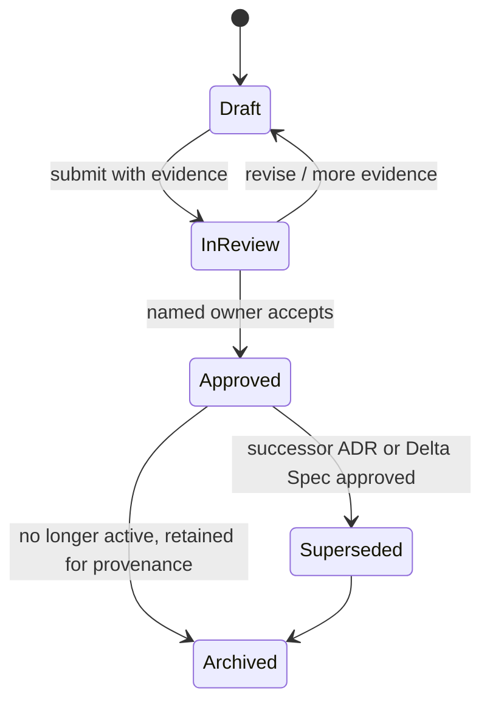
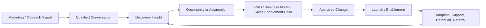

# Living Documentation and Version-Control Contracts

## Purpose

A “living document” should not mean an uncontrolled document that silently changes. It should mean a **current canonical artifact with explicit lineage**: source evidence, owner, status, review date, change record, and links to the decisions that made it current.

## 1. Required Metadata Header

Add this header to all controlled Markdown artifacts except raw evidence copies.

```yaml
---
id: "<artifact type>-<YYYY>-<sequence>"
title: "<clear title>"
mission_id: "HB-YYYY-NNN"
artifact_type: "mission_brief | evidence_ledger | opportunity_map | business_plan | prd | srs | adr | delta_spec | risk_register | release_packet | handoff"
status: "draft | in_review | approved | superseded | archived"
owner: "<named role or person>"
decision_owner: "<named role or person>"
created: "YYYY-MM-DD"
updated: "YYYY-MM-DD"
review_by: "YYYY-MM-DD"
evidence_ids: ["EV-001"]
related_decisions: ["ADR-001"]
supersedes: []
superseded_by: []
confidentiality: "public | internal | restricted"
---
```

## 2. Artifact Contracts

| Artifact | Canonical purpose | Required fields beyond metadata | Promotion rule |
|---|---|---|---|
| Mission Brief | Defines one approved workstream. | Outcome, scope, non-goals, owner, gate, success measure, next action. | G0 mission admission. |
| Evidence Ledger | Records material source claims and their use. | Source, access date, status, confidence, restriction, interpretation, linked artifact. | Append/change logged; no unsourced factual promotion. |
| Assumption Register | Makes uncertainty actionable. | Assumption, importance, evidence level, test, owner, due date, result. | G1/G2 review. |
| Opportunity Map | Connects user outcomes to problem/opportunity/solution choices. | Target user, job, opportunity, evidence IDs, solution hypotheses, learning priority. | Product owner review. |
| Business Model | Defines creation, delivery, and capture of value. | Customer, value, channel, revenue/cost assumption, key risk, milestone. | Strategy/finance owner review. |
| PRD | Defines what outcome and experience the product must create. | Goals/non-goals, users, user stories, requirements, measures, risks, linked evidence. | Product scope gate. |
| SRS | Defines how the system must behave and be constrained. | Functional/NFR requirements, data, roles, interfaces, acceptance criteria, risk controls. | Build authorization gate. |
| ADR | Records a material decision and its rationale. | Context, options, decision, evidence, consequences, owner, review/supersession. | Named decision owner approval. |
| Delta Spec | Records a modular proposed or accepted change. | Trigger, rationale, scope, acceptance criteria, dependency, risk, rollback, measurement. | Relevant product/process/technical owner. |
| Risk Register | Tracks material uncertainty and adverse outcomes. | Risk, likelihood, impact, owner, mitigation, trigger, residual risk, review date. | Risk owner accepts or escalates. |
| Release Packet | Supports a release decision. | Scope, test evidence, known risk, support plan, rollback, telemetry, approver. | G5 release authorization. |
| Master Handoff | Preserves cross-session continuity. | Read-first artifacts, current state, decisions, risks, open questions, exact next action. | Operations steward maintains; source control preserves history. |

## 3. Controlled State Model



## 4. Source-Control Rules

1. Never delete raw evidence. Correct catalog errors with a new ledger entry or a documented amendment.
2. Never silently overwrite an approved artifact. Create a successor version, ADR, or delta specification and link both directions.
3. Require one named owner and one next review date for every active artifact.
4. Make the mission ID, artifact ID, evidence IDs, and decision IDs searchable and stable.
5. Preserve external-source terms, confidentiality classification, and approved access scope with the source record.
6. Use pull requests or equivalent review for constitutional files, authority rules, production automation, material business/financial artifacts, SRS changes, and releases.
7. Run automated checks for missing metadata, broken links, missing acceptance criteria, unresolved high-risk items, and undocumented active decisions.

## 5. Evidence-to-Decision Trace

The operating system should be able to answer these questions for every material choice:

| Question | Required link chain |
|---|---|
| Why are we solving this problem? | Source → evidence ledger → opportunity map → mission brief. |
| Why is this feature in the MVP? | Opportunity/assumption → PRD requirement → MVP charter → acceptance criterion. |
| Why did we choose this technology? | Constraint/evidence → alternatives → ADR → SRS → implementation plan. |
| Why are we raising or spending capital? | Milestone/value map → operating model → scenario model → capital decision. |
| Why did a process or skill change? | Signal → evidence → evaluation → promotion candidate → versioned change. |
| Why was a risky action allowed? | Risk register → mitigation/test evidence → named human approval → audit trace. |

## 6. Commercial Evidence Loop

Sales and support should not live in a separate CRM silo that never reaches product or strategy. Normalize commercial signals into an evidence and learning pipeline.



| Signal type | Owner | Example use | Requires human review before |
|---|---|---|---|
| Prospect question | Sales/BD | Clarify ICP, objection, or messaging hypothesis. | Changing price, claim, or promise. |
| Lost deal | Sales + Product | Identify missing proof, product gap, or poor fit. | Treating one loss as a roadmap mandate. |
| Support ticket | Success/Support | Improve onboarding, documentation, reliability, or UX. | Policy, refund, SLA, or material product change. |
| Adoption/retention metric | Product + Success | Evaluate outcome and MVP success. | Making causal claim without controlled/evidence-backed analysis. |
| Partner request | BD + Strategy | Assess channel leverage, integration, or distribution opportunity. | External commitment, revenue share, or contract. |

## 7. Review Cadence

| Cadence | Purpose | Required artifact/output |
|---|---|---|
| Per mission gate | Decide the next irreversible or high-cost step. | Gate packet and decision log. |
| Weekly | Reconcile evidence, assumptions, blockers, and next actions. | Updated mission index, risk register, and open decision list. |
| Monthly | Review portfolio allocation, commercial learning, operating metrics, and process quality. | Portfolio review, dashboard, proposed deltas. |
| Quarterly | Reassess constitutional alignment, stakeholder strategy, architecture debt, and capital plan. | Strategy ADRs, roadmap update, risk posture. |
| Incident-triggered | Contain, learn, and prevent recurrence. | Incident record, corrective delta, updated control/test. |

## 8. Document Quality Definition

A document is operationally complete only when a new agent or human can answer: **what it is, why it exists, what evidence supports it, who owns it, which decision it supports, what has changed, what remains uncertain, and what happens next.**
