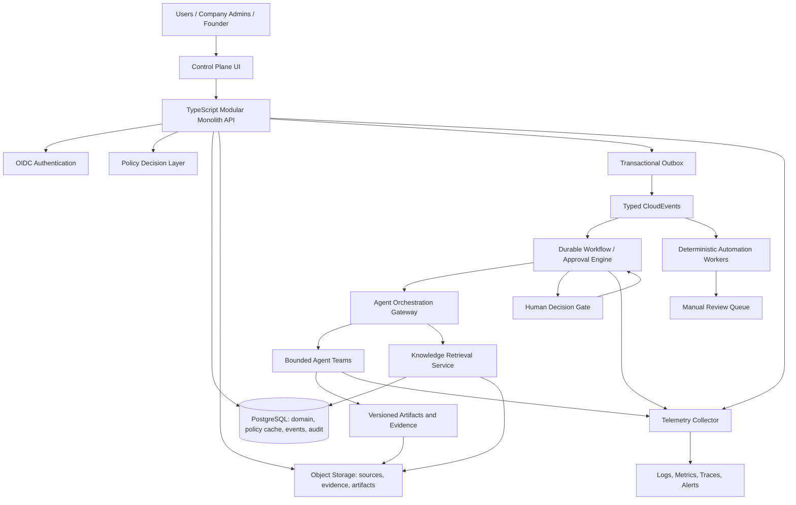
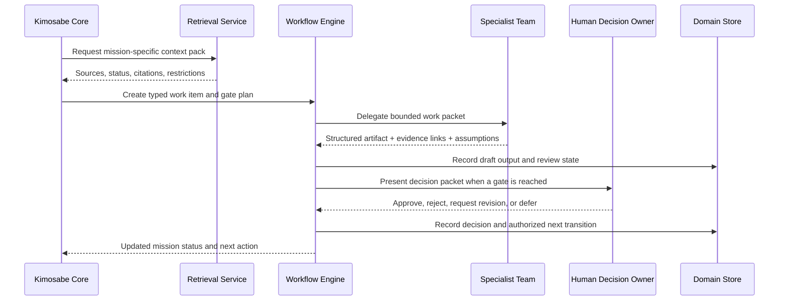

# DH Manus Operating System — Ultimate Stack Experimental Architecture

**Status:** Experimental architecture proposal on branch `experiment/ultimate-stack`. This is a design baseline, not an authorization to deploy regulated, financial, external-communication, or production-access capabilities.

## 1. Design Thesis

The appropriate “ultimate stack” is not a maximal collection of products. It is a **modular monolith with a governed control plane**, able to expand into specialized workers only when the RRCA pilot has demonstrated a real constraint. This directly follows the Human Blockchain commissioning brief’s instruction to use a primary TypeScript monorepo, PostgreSQL, object storage, typed events, server-side permissions, and a single end-to-end RRCA loop before scaling.[1]

The system must make the founder less of a manual integration layer without replacing founder authority. Each agent, automation, user, and service receives a scoped identity, a declared organization/entity/group context, a bounded work contract, auditable inputs and outputs, and an escalation path. The platform should automate evidence collection, task creation, monitoring, testing, and drafts; it should **not** autonomously perform irreversible financial, legal, access, publishing, external-communication, or production-release actions.[1]

> **Architecture rule:** Build one authoritative system of record, one evidence layer, one event vocabulary, and one governed decision trail before adding autonomous workers or microservices.

## 2. Decision Frame: Three Viable Stack Paths

| Path | What it is | Strengths | Tradeoffs | Best immediate use |
|---|---|---|---|---|
| **A. Managed application launchpad** | A managed full-stack internal control application with integrated sign-in, database, storage, API, and background jobs. | Fastest path to an operator dashboard, tasks, approvals, and early RRCA workflow UI; minimal infrastructure work. | The managed template’s default data layer may not be PostgreSQL, so it does not fully match the commissioning brief’s stated core database direction. Connector access also requires explicit bridging or separately managed credentials. | Prototype the operating UX, approvals, and one simple closed loop before external integrations or complex retrieval. |
| **B. Sovereign all-in-one testbed** | A persistent cloud computer running Dockerized application, database, agent, workflow, and monitoring services. | Maximum control; supports custom runtimes, a fixed IP, Docker, persistent workers, and Hermes-style services. | Highest operations burden and risk of running too many stateful components on one machine; requires patching, backups, firewalling, secrets, and recovery testing. | Isolated infrastructure experiments or components that genuinely require Docker/OS-level control. |
| **C. Hybrid control plane — recommended for design validation** | A TypeScript modular monolith with managed PostgreSQL/object storage and a small persistent worker environment only for agent/orchestration capabilities that cannot run in the managed app tier. | Best fit for the Human Blockchain data model while minimizing operational burden; separates durable business data from experimental agents; makes later migration/replacement easier. | Requires clear contracts between app, database, storage, workflows, and agent workers. | Build the RRCA beta and the reusable operating system together without prematurely self-hosting every component. |

A cloud computer is warranted only where a hard requirement exists—Docker, custom runtimes, operating-system control, fixed IP, or resources beyond the managed application environment. Persistence alone is not a sufficient reason to leave managed hosting.[2] A persistent cloud computer is available in Basic, Standard, and Advanced tiers at $10, $30, and $50 per month respectively; the actual tier should follow measured workload and a recovery plan rather than aspiration.[3]

## 3. Recommended Experimental Target: Hybrid Modular Monolith

The recommendation is to create the **Hybrid control plane** first. It preserves a portable, TypeScript-centered core while allowing a separate agent/integration plane to be experimented with and replaced. The initial product remains one coherent application and one canonical database schema. It does not become a microservice estate.

## 4. The Core Data and Evidence Plane

| Component | Initial responsibility | Design rule |
|---|---|---|
| **PostgreSQL** | Canonical transactional state for people, organizations, entities, stakeholder groups, roles, permissions, Leads, Offers, Projects, Jobs, Tasks, decisions, risks, events, and agent assignments. | Use a single database first, with migrations, constraints, typed schemas, audit fields, and only narrowly scoped administrative access. |
| **Row-Level Security** | Defense-in-depth isolation of data by organization/entity/group context. | Enable it table by table only after testing; avoid normal application connections that own tables or bypass RLS. PostgreSQL documents default-deny behavior when RLS is enabled without a policy, and owner/bypass roles need special handling.[4] |
| **Object storage** | Immutable or versioned source files, evidence attachments, generated artifacts, exports, media, and retention-managed records. | Store file bytes outside the database; store content hash, source metadata, sensitivity, retention policy, and authorized references in PostgreSQL. |
| **Source registry** | Provenance for every ingestion item: platform/account, source path/ID, hash, access rule, parsing status, sensitivity, derived outputs, and review status. | Preserve source material unchanged; derived summaries/chunks/embeddings must carry lineage to their source. |
| **Knowledge retrieval** | Mission-specific retrieval across source metadata, full text, selected embeddings, and linked decisions/risks. | Begin with path/metadata/full-text retrieval. Add pgvector only after the ingestion vertical slice has clear retrieval-evaluation cases. Every response should cite source paths and classify its claim status. |
| **Transactional outbox** | Atomically records domain events with the state change that produced them. | Do not perform uncoordinated dual writes to the database and a queue/webhook. Publish at-least-once events from the outbox; make consumers idempotent.[5] |

The initial event contract should use typed schemas and contain: `event_id`, `event_type`, `occurred_at`, `correlation_id`, actor, active entity/group context, object/version, prior/new state when applicable, evidence references, authorization basis, and idempotency key. CloudEvents supplies a useful interoperable envelope for this metadata.[6]

## 5. Identity, Authorization, and Consent Plane

The platform’s core authorization question is not merely “is the user logged in?” It is: **who is acting, through which entity and stakeholder group, under what role and permission, on which object, subject to which agreement/SLA, evidence requirement, and review/override process?** That is the Human Blockchain’s universal operating model.[1]

| Layer | Initial choice | Later capability | Required control |
|---|---|---|---|
| Authentication | OIDC using Authorization Code with PKCE. Internal operator access may begin with the managed application’s existing sign-in mechanism if it maps cleanly to OIDC claims. | Add external identity providers only after onboarding/consent requirements are defined. | No implicit or password grant flows; short-lived sessions; MFA for privileged roles. [7] |
| Organization context | Signed server-side request context for active organization, legal entity, stakeholder group, human role, and authorization version. | Add relationship-based authorization checks when delegation and cross-entity relationships become complex. | The active context must be explicit and validated, never inferred from UI navigation. |
| Authorization | Server-side policy service plus PostgreSQL RLS as defense-in-depth. | Use an OpenFGA-style relationship model for conditional delegation, team hierarchy, and resource sharing. | The policy decision and decision basis are recorded for consequential actions. |
| Consent and agreements | Versioned agreement/consent records linked to entity, role, jurisdiction, and workflow state. | Role-specific onboarding and renewal workflows. | Higher-risk actions remain blocked until required information and agreements are current. |
| Audit | Append-only audit events and decision records linked to correlation IDs. | Security analytics, anomaly detection, and reviewer dashboards. | Never log secret values, session tokens, or unnecessary sensitive data. [8] |

OpenFGA’s organization-context model illustrates a useful future pattern: a user must have the base relation **and** be acting in the appropriate organization context for access to be allowed. Its contextual tuples are request-scoped rather than durable; durable role/delegation relationships therefore remain a separate governed record.[9]

## 6. Workflow, Automation, and Integration Plane

A workflow is not a chat. It is a persistent state machine that can coordinate deterministic steps, agent work, human approvals, timeouts, retries, and compensation/rollback actions. The workflow engine should own long-running process state; agents should contribute bounded analysis/drafts and may not silently become the source of business truth.

| Function | Initial implementation | Promotion trigger |
|---|---|---|
| Domain state transitions | Application transactions plus outbox events. | No separate service until a demonstrated scaling/ownership constraint exists. |
| Short deterministic jobs | Worker process with idempotency key, retry policy, audit record, and alerting. | Add a dedicated queue when concurrent background work needs isolation. |
| Human approval / escalation | Database-backed decision packet and explicit human action. | Move to durable workflow orchestration when waits, multi-stage approvals, deadlines, or compensation flows span days/weeks. |
| Long-running workflow | Temporal-compatible workflow engine or equivalent durable state machine. | Use when there are real cross-service dependencies or long human-review latency. Temporal’s approval pattern records signal-delivered approver/decision context and safely resumes after a timeout or approval.[10] |
| Agent invocation | Typed work packet through an orchestration gateway; structured output validated before state promotion. | Add graph-based agent orchestration only when multiple agent dependencies cannot be expressed as a simple workflow. |
| External integrations | Signed inbound webhooks; outgoing side effects routed through approval-aware adapters. | Add connectors or vendor APIs after their explicit owner, credential lifecycle, rate limits, and data scope are defined. |
| Exception handling | Manual-review/dead-letter queue with source event, failure reason, retry history, and safe replay control. | No automatic replay of irreversible side effects. |

For third-party connectors that depend on renewable OAuth credentials, the persistent stack should not copy opaque refresh-token behavior into an uncontrolled runtime. It should either use a user-owned OAuth integration with appropriately managed credentials or use a purpose-built agent/API bridge that keeps the connector lifecycle inside the authorized platform boundary.[11]

## 7. Agent Operating Model: Multiple Teams, One Control Plane

The objective is not to maximize the number of agents. It is to create a **federated team-of-teams** model where different roles work from a shared evidence system while preserving boundaries of authority, data access, and code ownership.

| Team | Primary mission | Typical roles | Permitted outputs | Prohibited independent action |
|---|---|---|---|---|
| **Kimosabe Core / Mission Control** | Admit missions, assemble context, route work, maintain status, and create decision packets. | Chief Orchestrator, Operations Steward, Documentation Steward. | Work graph, context pack, decision packet, handoff. | Changing authority, approving releases, binding an entity. |
| **Knowledge and Evidence** | Ingest, preserve, classify, retrieve, cite, and evaluate corpus material. | Librarian, Data/Knowledge Engineer, Source Reviewer. | Source registry, retrieval pack, lineage report, evaluation case. | Promoting inference to founder decision or exposing restricted sources. |
| **Product and Engineering** | Turn approved outcomes into PRD/SRS, architecture, implementation, tests, and release evidence. | Product Lead, UX Lead, Architect, Application Engineer, QA/Security Reviewer. | PRD, SRS, ADR, code branch, tests, release packet. | Production release without required gates; silently changing policy. |
| **Company Admin and Operations** | Run Need-to-Done processes, SLAs, evidence checks, task routing, and exception management. | Company Admin Agent, Workflow Coordinator, Reconciliation Support. | Draft tasks/notices/reports, SLA exceptions, missing-evidence requests. | Granting authority, moving money, accepting offers, coverage decisions. |
| **Market, Growth, and Culture** | Test audience needs, domains, content, discovery, sales enablement, and support learning. | Domain Research, Growth, Sales/BD Support, Customer Success, Culture Lead. | ICPs, content drafts, account maps, feedback deltas. | External contact, unsupported claims, price/contract commitments. |
| **Finance, Risk, and Institutional Review** | Prepare scenario models, risk packages, governance evidence, and reviewer queues. | Finance Support, Compliance Support, Risk Reviewer, Institutional Liaison Support. | Assumption models, review packets, risk entries, valuation scenarios. | Practice law/accounting, raise capital, move money, make regulated claims. |

Every agent receives a **work packet** that names the mission/work ID, objective/non-objectives, source-grounded context pack, allowed tools/data, output artifact and acceptance criteria, evidence standard, timebox, expected cost, escalation condition, and idempotency/correlation ID. This makes agent collaboration inspectable and reduces invisible context drift.

No two agents should write to the same branch or checkout concurrently. Material code or documentation work occurs in separate branches/worktrees and reaches the integration branch through review and tests, consistent with the knowledge-bundle engineering rules.[12]

## 8. Agent Orchestration Contract

The core contract has five non-negotiable rules:

1. **Retrieval precedes reasoning** for Human Blockchain-specific work.
2. **Structured outputs precede state promotion** for agent-to-agent handoffs.
3. **Approval precedes consequential action** for defined risk classes.
4. **Idempotency precedes retries** for any state-changing or external operation.
5. **Evidence and measurement precede self-improvement** when changing memory, skills, workflows, policies, or models.

## 9. Operations, Security, and Recovery Plane

| Control | Minimum experimental standard | Why it matters |
|---|---|---|
| Secrets | Separate secret store/environment configuration; never source control; scoped service identities; rotation plan. | Connector/API keys can expose high-impact access. |
| Network | Private internal service network where possible; HTTPS at ingress; signed webhooks; narrow firewall rules; no public databases or unprotected admin panels. | The persistent-compute environment opens only SSH and ICMP by default; required ports must be opened intentionally and protected.[3] |
| Telemetry | OpenTelemetry traces, logs, and metrics with correlation/work IDs; scrub sensitive fields before export. | A multi-agent workflow cannot be safely operated if the team cannot explain the path from source to decision to side effect. [13] |
| Backup | Automated database/object-store backups, encrypted retention, and documented restore exercises. | A backup is not a recovery control until restoration is tested. |
| Recovery | Versioned IaC/runbooks, restartable/idempotent jobs, workflow replay policy, data recovery objective, incident packet. | The knowledge bundle explicitly requires durable/restartable ingestion and transformation jobs.[12] |
| Access | Least-privilege service accounts, privileged-action audit, break-glass procedure, separate sandbox/demo/case-study/production data. | The commissioning brief requires entity isolation and never feeding unrestricted regulated data to agents by default.[1] |
| Change control | Feature branches, pull requests, CI checks, ADRs, migration review, staged release, rollback plan. | Controls agent and human changes with a common review trail. |

OpenTelemetry is appropriate as the common telemetry vocabulary, but it is a visibility mechanism—not a substitute for a source ledger, event store, decision register, or security policy.[13]

## 10. Development, Documentation, and Promotion Plane

The GitHub repository remains the shared continuity/review layer. The baseline tag `v0.1.0-session-baseline` is preserved on `main`; all stack exploration belongs in `experiment/ultimate-stack` until an approved pull request promotes a coherent, tested increment.

| Asset | Repository location | Promotion rule |
|---|---|---|
| Constitution and authority | Human Blockchain knowledge bundle and linked operating documents. | Founder/governance approval and linked decision record. |
| Architecture | `docs/architecture/` plus ADRs. | Named architecture/product owner accepts the decision after alternatives/risk review. |
| Workflows and agent contracts | `docs/protocols/`, `packages/contracts/`, tests. | Contract validation, evaluation cases, and risk-owner approval. |
| Application code | Monorepo apps/packages. | Pull request, automated checks, review, environment gate where available. |
| Source/evidence records | Immutable storage plus source registry. | Append/correct through lineage; do not silently overwrite raw source. |
| Agent/automation improvements | Versioned skills/processes with evaluation cases. | Evidence-linked promotion candidate, test result, human approval, and monitoring. |

GitHub Environments may enforce required reviewers, wait timers, branch/tag constraints, and secrets gating before a deployment job can run. Actual availability varies by account plan and repository visibility, so this capability must be verified before becoming a mandatory beta control.[14]

## 11. What Not to Build Yet

The following are intentionally deferred. They would add complexity without advancing the first RRCA closed loop:

| Deferred component | Why it is deferred | Trigger to reconsider |
|---|---|---|
| Kubernetes or service mesh | Too much operational surface for a modular monolith and small team. | Multiple independently scaling services and a proven platform-operations owner. |
| Microservice decomposition | Splits the evidence trail and deployability before domain boundaries are proven. | A bounded module has distinct scaling, security, deployment, and ownership needs. |
| Multiple production databases | Risks source-of-truth ambiguity. | A defined regulatory/data-residency/performance need with a reconciliation design. |
| Autonomous public outreach or transactions | Contradicts founder authority, approvals, and regulatory boundaries. | A narrowly defined, lawful, tested delegation and an approved action policy. |
| Full corpus vectorization as a prerequisite | Delays delivery and can obscure provenance. | The artifact-first ingestion slice has source registry, permissions, evaluation cases, and clear retrieval failures. |
| Hermetic self-modifying agents | Unverifiable and difficult to roll back. | Controlled-promotion process shows repeatable, measurable improvement. |
| “One prompt runs everything” runtime | Confuses orchestration instructions with durable application state and authority. | Never as a substitute for the control plane; prompts remain an entry point into governed workflows. |

## 12. Recommended First Experimental Slice

Build an **Internal Mission Control and RRCA Case-Study Slice**. It should not process live regulated data or make external commitments. It should demonstrate the operating system with synthetic or authorized test data.

| Capability | Minimum proof |
|---|---|
| Sign-in and active-context switch | An authorized user can select an entity/group/role context and see only permitted synthetic records. |
| Mission registry | A mission has owner, status, decision owner, sources, assumptions, risks, work items, and next gate. |
| Knowledge context pack | A mission retrieves and cites a small set of Human Blockchain source documents with status and restrictions. |
| Lead-to-Task prototype | A synthetic Lead produces a typed event, an attributable Task, and an evidence checklist. |
| Bounded agent work | One agent generates a draft artifact from a packet; another performs a structured review; neither changes domain state without an approval. |
| Human decision gate | Founder accepts/rejects/defers a decision packet; the result is stored, traceable, and resumes or closes the workflow. |
| Observability | The dashboard can trace a mission/work item from source retrieval through agent output, review, decision, and next event. |
| Recovery | The application can restart without losing workflow state, and test data can be restored from a documented backup. |

## References

[1]: https://github.com/donaldhaight/human-blockchain-operating-system/blob/main/docs/00-start-here/master-continuity-brief.md "Human Blockchain Master Continuity Brief — sections 19–24"
[2]: https://github.com/manus-ai/skills/blob/main/persistent-computing/SKILL.md "Persistent Computing decision logic"
[3]: https://manus.im/app#settings/my-computer/create "Cloud Computer provisioning; tier and operational guidance reviewed in session"
[4]: https://www.postgresql.org/docs/current/ddl-rowsecurity.html "PostgreSQL Row Security Policies"
[5]: https://microservices.io/patterns/data/transactional-outbox.html "Transactional Outbox Pattern"
[6]: https://github.com/cloudevents/spec/blob/v1.0.2/cloudevents/spec.md "CloudEvents Specification"
[7]: https://openid.net/specs/openid-connect-core-1_0.html "OpenID Connect Core"; https://oauth.net/2/oauth-best-practice/ "OAuth 2.0 Security Best Current Practice"
[8]: https://cheatsheetseries.owasp.org/cheatsheets/Logging_Cheat_Sheet.html "OWASP Logging Cheat Sheet"
[9]: https://openfga.dev/docs/modeling/organization-context-authorization "OpenFGA: Authorization Through Organization Context"
[10]: https://docs.temporal.io/design-patterns/approval "Temporal Approval Pattern"
[11]: https://api.manus.ai "Manus API integration and connector guidance reviewed in session"
[12]: https://github.com/donaldhaight/human-blockchain-operating-system/blob/main/AGENTS.md "Human Blockchain Operating System — Agent Instructions"
[13]: https://opentelemetry.io/docs/concepts/ "OpenTelemetry Concepts"
[14]: https://docs.github.com/en/actions/deployment/targeting-different-environments/using-environments-for-deployment "GitHub deployment environments"
