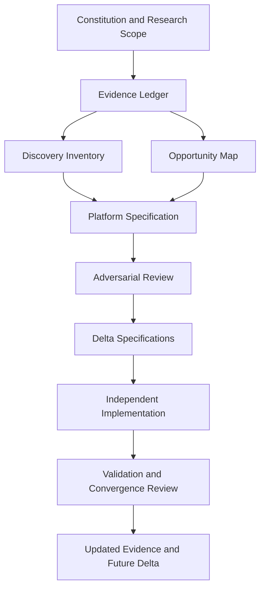

# Master Handoff: [Project Name]

| Field | Value |
|---|---|
| Session / workstream | [Name] |
| Prepared | [YYYY-MM-DD] |
| Prepared by | Manus AI |
| Current status | [Research / Validation / Specification / Implementation / Monitoring] |
| Decision owner | [Role / person] |

> Read this document, the current evidence ledger, and the latest Delta Specifications before changing the platform or its governing specification.

## 1. Purpose and Current Decision

[State the decision this work supports, the target user/outcome, the reference scope if any, and the differentiated platform thesis.]

## 2. Deliverables Index

| File | Purpose | Status | Source of truth / version |
|---|---|---|---|
| `constitution.md` | Constraints, success definition, and non-negotiables | [Status] | [Path/version] |
| `research_scope.md` | Authorized evidence scope and exclusions | [Status] | [Path/version] |
| `evidence_ledger.md` | Provenance, confidence, restrictions, and decisions | [Status] | [Path/version] |
| `discovery_inventory.md` | Evidence-led observations and comparison matrix | [Status] | [Path/version] |
| `opportunity_map.md` | Outcomes, opportunities, solutions, and assumptions | [Status] | [Path/version] |
| `platform_specification.md` | Independent functional and non-functional requirements | [Status] | [Path/version] |
| `adversarial_review_notes.md` | Risk review and closure plan | [Status] | [Path/version] |
| `delta_specs_YYYY-MM-DD.md` | Modular approved changes | [Status] | [Path/version] |
| `MASTER_HANDOFF_<project>.md` | This document | [Status] | [Path/version] |

## 3. Confirmed Decisions and ADRs

| ID | Decision | Rationale and evidence | Owner | Status |
|---|---|---|---|---|
| ADR-001 | [Decision] | [Evidence IDs / review finding / product rationale] | [Role] | [Accepted / Superseded / Pending] |

## 4. Evidence, Assumptions, and Risk Status

| Item | Type | Status | Confidence / severity | Required next action |
|---|---|---|---|---|
| [ID] | [Evidence / assumption / risk] | [Open / validated / accepted / resolved] | [H/M/L] | [Action] |

## 5. Dependency Graph

## 6. Implementation and Validation Status

[Summarize what has been independently implemented, what has been verified, unresolved acceptance criteria, known limitations, and rollback/monitoring posture.]

## 7. Open Questions and Next Action

### Required reading for the next session

1. [File and reason]
2. [File and reason]
3. [File and reason]

### Immediate next action

[Specify the smallest decisive research, validation, specification, or implementation action.]

### Questions requiring a user decision

1. [Question]
2. [Question]

## 8. Session Metadata

| Field | Value |
|---|---|
| Method | DH Method Competitive Intelligence and Platform Evolution |
| Reference scope | [URLs, approved artifacts, or N/A] |
| Authorized access level | [Public / user-provided / other approved scope] |
| Latest delta | [Path or N/A] |
| Source-control checkpoint | [Commit/hash or N/A] |
